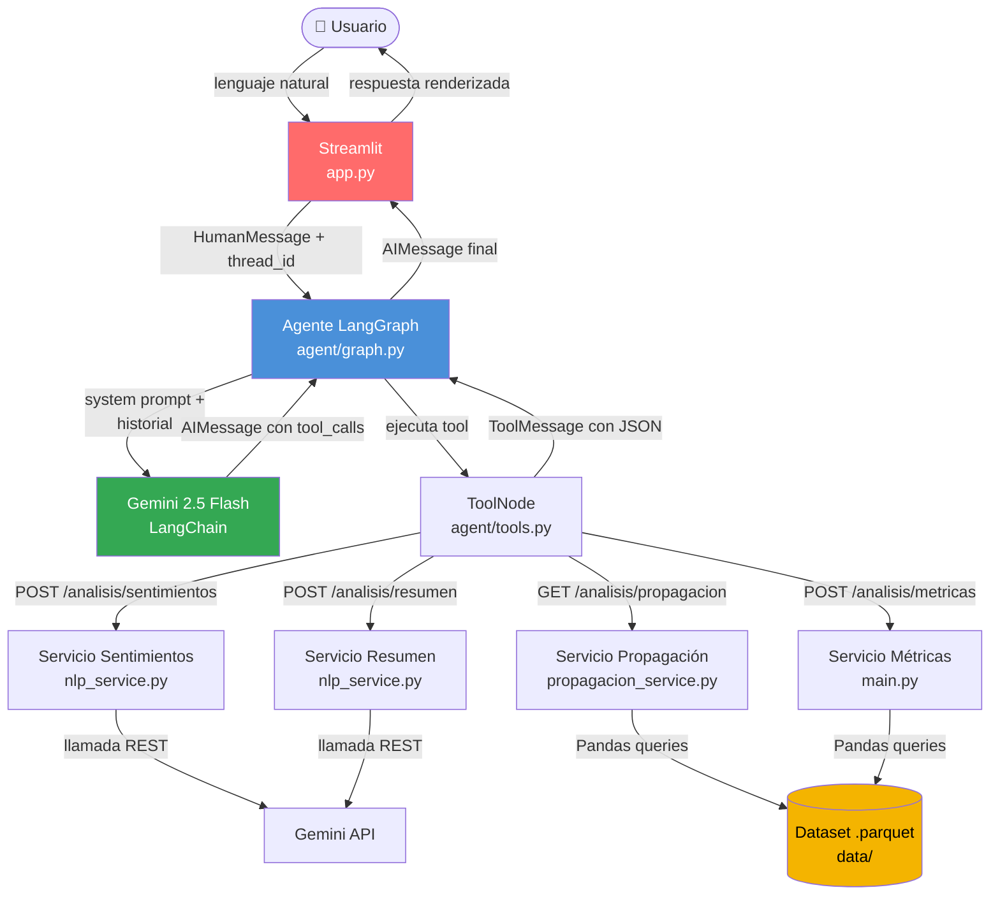
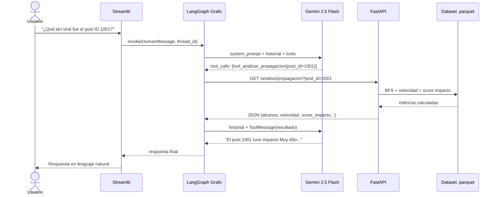

# Reto ICESI — Agentes Conversacionales y Análisis de Conversaciones Digitales

**Universidad Icesi · Reto AI Engineering**  
Stack: Python · FastAPI · LangGraph · Gemini 2.5 Flash · Streamlit

---

## Arquitectura del Sistema



---

## Flujo de una Consulta (Secuencia)



---

## Requisitos Previos

- Python 3.11 o superior
- API Key de Google Gemini → [aistudio.google.com/app/apikey](https://aistudio.google.com/app/apikey) (gratis)
- Dataset `.parquet` → [descargar aquí](https://github.com/armandoordonez/AI-Engineering/blob/main/data/Reto_data_20251023_122206.parquet)

---

## Instalación

```bash
# 1. Clonar el repositorio
git clone <url-del-repo>
cd Agentes-Conversacionales

# 2. Crear y activar el entorno virtual
python -m venv .venv

# Windows
.\.venv\Scripts\activate
# macOS / Linux
source .venv/bin/activate

# 3. Instalar dependencias
pip install -r requirements.txt

# 4. Colocar el dataset
mkdir data
# Copiar Reto_data_20251023_122206.parquet dentro de data/
```

---

## Configuración del Entorno

Crea el archivo `.env` en la raíz (nunca lo subas a git):

```env
# Proveedor LLM: "openai" o "gemini"
LLM_PROVIDER=gemini

# Google Gemini
GEMINI_API_KEY=tu-api-key-aqui
GEMINI_MODEL=gemini-2.5-flash

# OpenAI (alternativa)
OPENAI_API_KEY=sk-tu-key-aqui
OPENAI_MODEL=gpt-4o-mini

# URL base de la API (no cambiar si corres local)
API_BASE_URL=http://127.0.0.1:8000
```

---

## Cómo Correr la Aplicación

Se necesitan **dos terminales corriendo en paralelo**.

### Terminal 1 — API FastAPI (Backend MCP)

```bash
.\.venv\Scripts\uvicorn.exe main:app --reload --port 8000
```

Swagger UI disponible en: [http://127.0.0.1:8000/docs](http://127.0.0.1:8000/docs)

| Método | Ruta | Descripción |
|---|---|---|
| `POST` | `/analisis/sentimientos` | Clima emocional de un texto |
| `POST` | `/analisis/resumen` | Resumen y temas de una conversación |
| `GET` | `/analisis/propagacion?post_id=X` | Propagación e impacto de un mensaje |
| `POST` | `/analisis/metricas` | Estadísticas generales de la red |

### Terminal 2 — Interfaz Streamlit (Frontend)

```bash
.\.venv\Scripts\streamlit.exe run app.py
```

Se abre en: [http://localhost:8501](http://localhost:8501)

---

## Estructura del Proyecto

```
Agentes-Conversacionales/
│
├── app.py                          # Interfaz Streamlit (Rol 4)
├── main.py                         # Servidor FastAPI — entry point (Rol 1)
├── data_loader.py                  # Carga y normalización del .parquet (Rol 1)
├── schemas.py                      # Contratos Pydantic (Rol 1)
├── requirements.txt
├── .env                            # Variables de entorno (NO subir a git)
│
├── agent/                          # Capa de Orquestación — Rol 4
│   ├── tools.py                    # 4 tools @tool de LangChain
│   └── graph.py                    # Grafo LangGraph + MemorySaver
│
├── routers/
│   └── propagacion_endpoint.py     # GET /analisis/propagacion (Rol 3)
│
├── services/
│   ├── nlp_service.py              # LLM: sentimientos + resumen (Rol 2)
│   └── propagacion_service.py      # BFS + velocidad + score (Rol 3)
│
├── data/                           # Dataset (NO subir a git)
│   └── Reto_data_20251023_122206.parquet
│
└── tests/
    ├── test_tools.py               # 12 tests de tools
    └── test_graph.py               # 11 tests de grafo y memoria
```

---

## Correr los Tests

```bash
.\.venv\Scripts\pytest.exe tests/ -v
# Resultado esperado: 23 passed
```

---

## Ejemplos de Consultas al Agente

| Consulta | Tool invocada |
|---|---|
| "¿Cómo está el clima de esta conversación: '...'" | `tool_analizar_sentimiento` |
| "Resume estos comentarios: ['...', '...']" | `tool_resumir_conversacion` |
| "¿Qué tan viral fue el post con ID 1001?" | `tool_analizar_propagacion` |
| "¿Quiénes son los usuarios más influyentes?" | `tool_analizar_metricas` |

---

## Notas de Seguridad

- El `.env` está en `.gitignore` y **nunca debe subirse al repositorio**.
- Regenera tu API key si sospechas que fue expuesta: [aistudio.google.com/app/apikey](https://aistudio.google.com/app/apikey)
